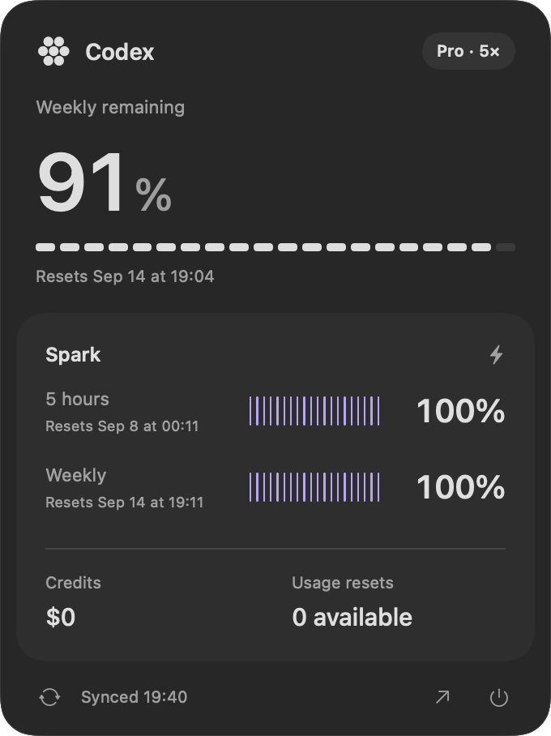
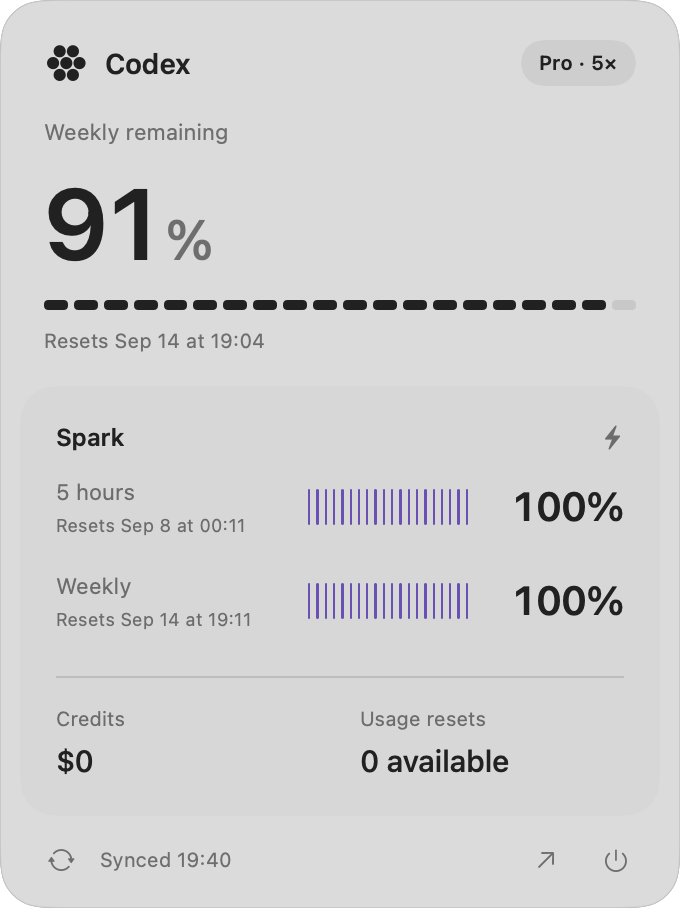

# Mini Token Bar

**Your Codex limits, one glance away.** A tiny native macOS menu-bar app showing remaining usage, reset times, and a compact account overview. The installed app is called **CodexQuota**.

<p align="center"> </p>
<p align="center"><sub>Native interface rendered with example data.</sub></p>

- **Always visible:** remaining quota as a single percentage for one window; `5h` / `week` labels only when there are multiple windows.
- **One click:** general and Spark limits, reset dates, plan, credits, and available resets.
- **Stays current:** refreshes every minute and when opened; supports weekly-only plans.
- **Native feel:** frosted background, automatic light/dark themes, and a panel kept inside the current display.
- **Small and private:** SwiftUI + AppKit, no dependencies, no analytics, no task-history access.

## Install with Codex

Copy this prompt into **Codex on your Mac**:

```text
Install CodexQuota from https://github.com/sanekovs/minitokenbar on this Mac. Read INSTALL.md and follow it: check prerequisites, clone the repo, build, install, launch, and verify the app is running. Never print or upload my Codex credentials.
```

That's the whole request. Codex handles the steps in [INSTALL.md](INSTALL.md). If Apple Command Line Tools are missing, macOS needs you to finish their installer first.

**Requires:** macOS 14+, Apple Command Line Tools or Xcode, and Codex signed in with a ChatGPT subscription. Tested on Apple Silicon. API-key mode has no subscription quota to display.

<details>
<summary>Install manually</summary>

```sh
git clone https://github.com/sanekovs/minitokenbar.git
cd minitokenbar
./scripts/install.sh
```

Builds locally, installs to `/Applications` (or `~/Applications` if needed), and launches. No administrator password required. Run the same script again to update a local build.

</details>

## Privacy & limitations

The app reads `~/.codex/auth.json` and uses the existing session to request usage directly from `chatgpt.com`. Credentials are never logged or sent elsewhere. Task history is not read. Missing values stay unavailable; failed refreshes retain the previous values with a warning.

This is an unofficial tool, not affiliated with OpenAI. It uses an undocumented usage endpoint that may change. It displays subscription quota percentages, not a raw token count. No purchases or usage resets are triggered by the app.

## Development

```sh
swift build -c release
zsh scripts/test-parser.sh
zsh scripts/test-panel.sh
```

To uninstall, quit CodexQuota and move `CodexQuota.app` from its installation folder to Trash. The app does not modify your Codex account or set up automatic launch at login.

[MIT License](LICENSE)
